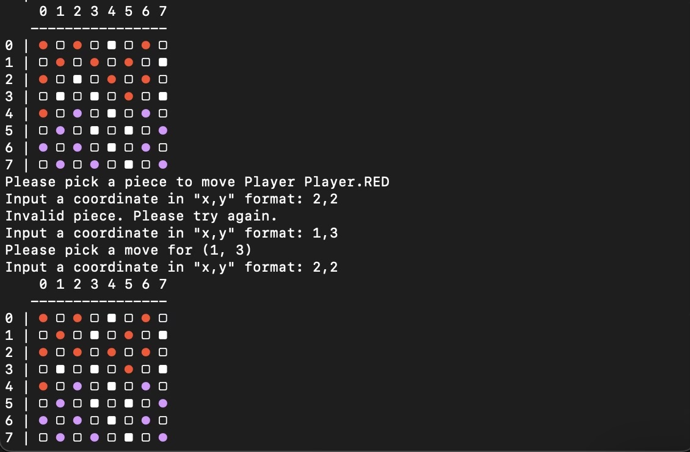

# CS32 Checkers
A distributed checkers in-terminal game for our cs32 final project.

## Instructions

### Connections
Go to https://github.com/gmazzarelli/cs32_checkers/edit/main/ to download the the repository onto your local computer(s). 

First, if you want to play on multiple computers, look up the IP address on the host computer. Then, in server.py and client.py, you can put this IP address in the host variable at the top. If you want to play on the same computer, just put this as the localhost ip '127.0.0.1'. Just make sure they both have the same port in the files. 

Now, run server.py first, then client.py subsequently.

### Playing the Game
* Selecting a piece
  * You select pieces/moves via the coordinate system. For (3,7) type in 3,7. Note. Here is an example:

   

* Jumps
  * We coded the regular rules to checkers. If a jump exists in the game, you must take that jump automatically as a rule. How our script works is that if there are multiple pieces that can be jumped, you will be prompted to select one of those. Otherwise, it will select that piece automatically. Then, it will show you the possible jumps that you can make, and you have to select it. It will loop until no jumps are left (allowing for double jumps).

* Normal jumps
  * If no jumps exist, you can select any piece with valid moves, and it will prompt you to select a move to go to. 
 
* Kings
  * If your player reaches the opposite end, it gets promoted and it turns into a heart. Now you can move in all 4 directions. 
 

